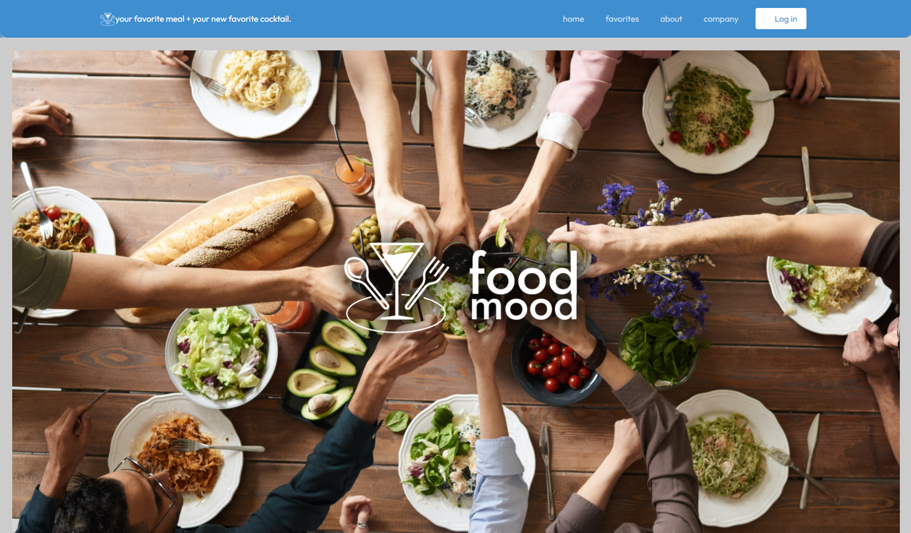
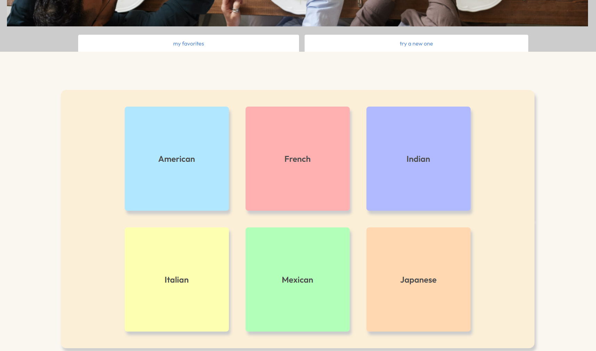
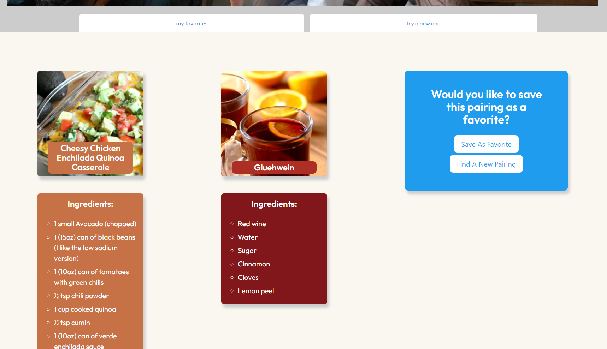
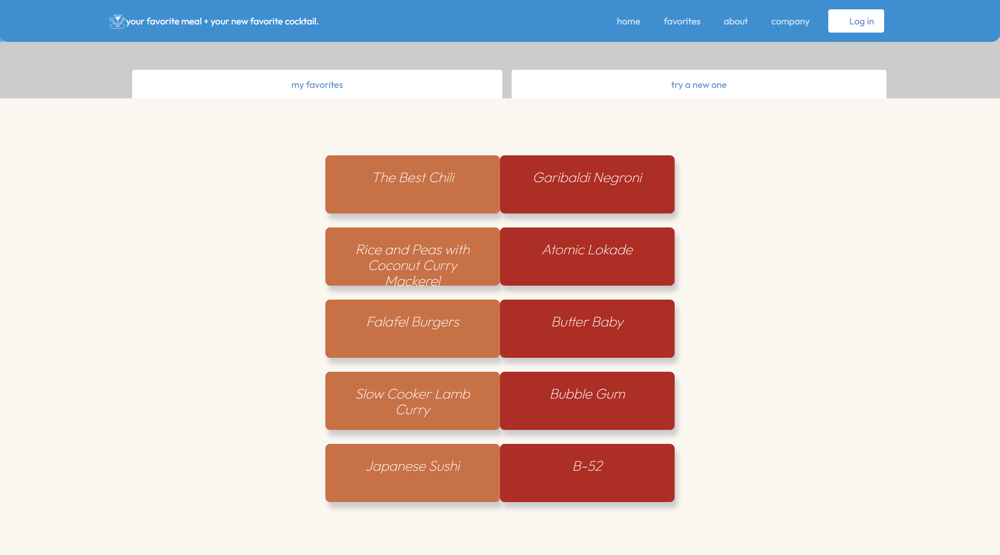

# Food Mood
Food Mood is an application that returns meals and cocktail for the user to make. The user can select from six difference cuisines, then they can select six different meal options from their specified cuisine. Once the meal is selected, they are given three cocktail options for the night. This application also has the option to save the users favorite pairings so they can go back and make it again.

## Our User Story

When I open the app,  
Then I am presented with an app description, a hero section, and multiple cuisine options to select from  
When I select a cuisine,  
Then I am presented with a few meal options based on that cuisine.  
When I select a meal option,  
Then I am presented with ingredients needed and a few cocktail options to choose from.  
When I select a cocktail,  
Then a cocktail with it's ingredients are presented, as well as an option to save the pairing or start over.  
When I want to save the current pairing as a favorite,  
Then I click on "Save to favorites" button and the pairing is saved locally.  

## What we used
In order to get the data on both the food and cocktails, as well as store the users favorite pairings, we used the following tools:
* Spoonacular API
* The CocktailDB API
* localStorage API
* HTML, CSS, JS, jQuery, and Bulma

## Using our application
Visit our project [here](https://adairconlin.art/food-mood/)! Fair warning: There is a limit to the amount of requests made per day.
### Introduction
Upon opening the application, the user is met with a navigation bar and a hero section with our custom-made FoodMood logo. When the user scrolls down, they can choose from the cuisine and then they can choose from the following sections as more options are dynamically loaded on to the page.

### Save your pairings
Once both cuisines are chosen, the user is introduced with an option to save their pairing or to start again. If the user wants to visit their saved pairings, they can use the "favorites" link on the navigation bar and they will be greeted by their history of favorites loaded onto the page.

### Future Development
* With both API's there are many different ways for users to search and sort for both the food and drink that they want
* All of the cocktail options could be selectively chosen based on the meal the user chose, based on optimial food and drink pairings
* An option to recieve the full set of recipe instructions for each food and drink
* Addition of multiple pages to the site, as well as login capabilities
* As with any development project, there is room to grow when it comes to the UI/UX

